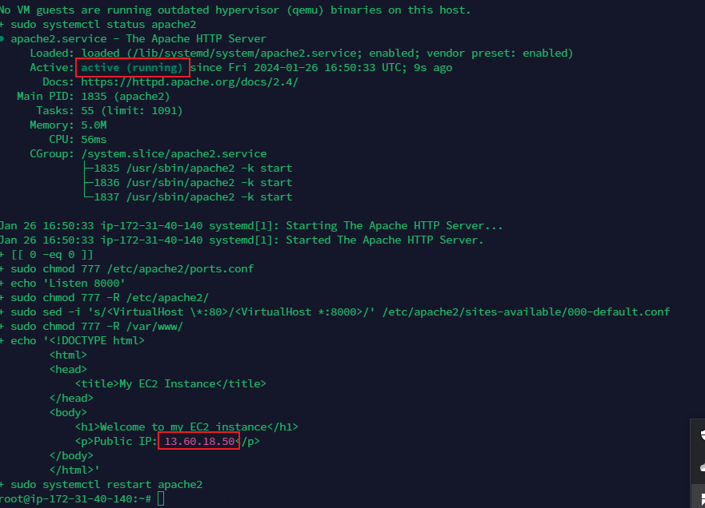

# Automating LoadBalancer Configuration with Shell scripting

## Introduction
In this project we would automate the setup and maintenance of a load balancer by writing a shell script that when we run, all the task would be done for us automatically.

Automation helps speed up the deployment of services and reduces the chance of making errors in our day to day activity.

## Deploying and configuring the Webservers

## STEPS

-  STEP 1: Provision an EC2 instance running ubuntu 20.04.

- STEP 2: Open port 8000 to allow traffic from anywhere using the security group. A

- STEP 3: Connect to the webserver via the terminal using SSH client

- STEP 4: Open a file called install.sh paste the script below the file using the command  *sudo vi install.sh*


```
#!/bin/bash

####################################################################################################################
##### This automates the installation and configuring of apache webserver to listen on port 8000
##### Usage: Call the script and pass in the Public_IP of your EC2 instance as the first argument as shown below:
######## ./install_configure_apache.sh 127.0.0.1
####################################################################################################################

set -x # debug mode
set -e # exit the script if there is an error
set -o pipefail # exit the script when there is a pipe failure

PUBLIC_IP=$1

[ -z "${PUBLIC_IP}" ] && echo "Please pass the public IP of your EC2 instance as an argument to the script" && exit 1

sudo apt update -y &&  sudo apt install apache2 -y

sudo systemctl status apache2

if [[ $? -eq 0 ]]; then
    sudo chmod 777 /etc/apache2/ports.conf
    echo "Listen 8000" >> /etc/apache2/ports.conf
    sudo chmod 777 -R /etc/apache2/

    sudo sed -i 's/<VirtualHost \*:80>/<VirtualHost *:8000>/' /etc/apache2/sites-available/000-default.conf

fi
sudo chmod 777 -R /var/www/
echo "<!DOCTYPE html>
        <html>
        <head>
            <title>My EC2 Instance</title>
        </head>
        <body>
            <h1>Welcome to my EC2 instance</h1>
            <p>Public IP: "${PUBLIC_IP}"</p>
        </body>
        </html>" > /var/www/html/index.html

sudo systemctl restart apache2

```


- Close the file and type :wq on the vi editor

- STEP 5: Change the permissions on the file to make it an executable file using syntax *sudo chmod +x install.sh*

-Step 6:Run the shell script using the command below. using the syntax:  *./install.sh PUBLIC_IP*. Where PUBLIC_IP is the PUBLIC address of the webservers


- After runing the script as shown in the images above  the apache software is installed on each of the webservers. The image below shows the output of the script




## Deployment of Nginx as a Load Balancer using Shell script
In the previous section we successfully deployed and configured two webservers, in this section we need to provision an EC2 instance running ubuntu 22.04, open port 80 to anywhere in the security and connect to the load balancer via the terminal. 

The script below has all the steps required to implement Load balancer with Nginx
```
#!/bin/bash

######################################################################################################################
##### This automates the configuration of Nginx to act as a load balancer
##### Usage: The script is called with 3 command line arguments. The public IP of the EC2 instance where Nginx is installed
##### the webserver urls for which the load balancer distributes traffic. An example of how to call the script is shown below:
##### ./configure_nginx_loadbalancer.sh PUBLIC_IP Webserver-1 Webserver-2
#####  ./configure_nginx_loadbalancer.sh 127.0.0.1 192.2.4.6:8000  192.32.5.8:8000
############################################################################################################# 

PUBLIC_IP=$1
firstWebserver=$2
secondWebserver=$3

[ -z "${PUBLIC_IP}" ] && echo "Please pass the Public IP of your EC2 instance as the argument to the script" && exit 1

[ -z "${firstWebserver}" ] && echo "Please pass the Public IP together with its port number in this format: 127.0.0.1:8000 as the second argument to the script" && exit 1

[ -z "${secondWebserver}" ] && echo "Please pass the Public IP together with its port number in this format: 127.0.0.1:8000 as the third argument to the script" && exit 1

set -x # debug mode
set -e # exit the script if there is an error
set -o pipefail # exit the script when there is a pipe failure


sudo apt update -y && sudo apt install nginx -y
sudo systemctl status nginx

if [[ $? -eq 0 ]]; then
    sudo touch /etc/nginx/conf.d/loadbalancer.conf

    sudo chmod 777 /etc/nginx/conf.d/loadbalancer.conf
    sudo chmod 777 -R /etc/nginx/

    
    echo " upstream backend_servers {

            # your are to replace the public IP and Port to that of your webservers
            server  "${firstWebserver}"; # public IP and port for webserser 1
            server "${secondWebserver}"; # public IP and port for webserver 2

            }

           server {
            listen 80;
            server_name "${PUBLIC_IP}";

            location / {
                proxy_pass http://backend_servers;   
            }
    } " > /etc/nginx/conf.d/loadbalancer.conf
fi

sudo nginx -t

sudo systemctl restart nginx

```
To run the script below we would follow the steps below

- Step 1: On your terminal, open a file nginx.sh using the command *sudo vi nginx.sh*

- Step 2: Copy and Paste the script inside the file

- Step 3: Close the file using the command below: *type esc the shift + :wq* 

- Step 4: Change the file permission to make  it an executable file using the command below  *sudo chmod +x nginx.sh*

- Step 5: Run the script with the command below:

*./nginx.sh PUBLIC_IP Webserver-1 Webserver-2*


